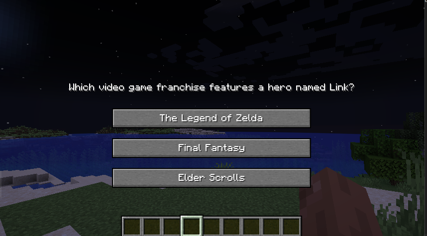
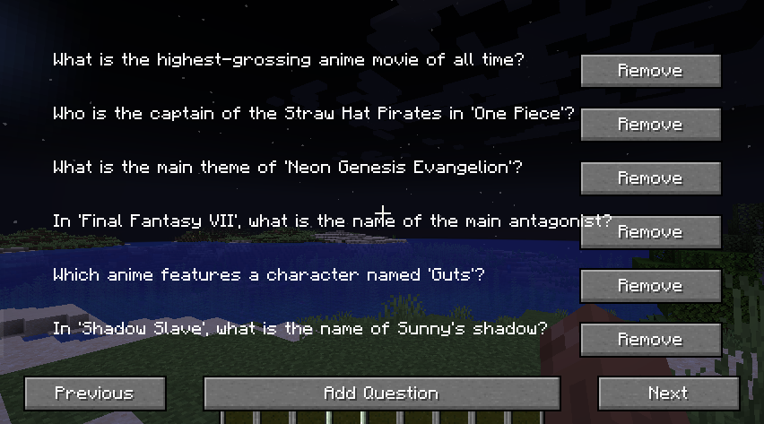

# MindCraft - BARREAU Romain 

## Overview
MindCraft is a Minecraft mod that allows users to manage and answer custom questions within the game. The mod provides a GUI for adding, listing, and removing questions.

## Features
- Add new questions with multiple answers and specify the correct answer.
- List all questions with pagination.
- Remove questions from the list.
- Keybindings to open the question list and configuration screens.

## Installation
1. Download and install [Minecraft](https://www.minecraft.net/).
2. Download and install [Fabric](https://fabricmc.net/use/).
3. press `Win + R` and type `%appdata%` open `Roaming` then `.minecraft`  to open the Minecraft directory.
4. Place the MindCraft mod `.jar` file into the `mods` folder of your Minecraft directory.

## Usage
- Press `M` to open the main GUI. If you answer a question correctly, you will receive a reward.

- Press `C` to open the question list screen.

- Use the GUI to add, list, and remove questions.

## Keybindings
- `M`: Open the main GUI.
- `C`: Open the question list screen.